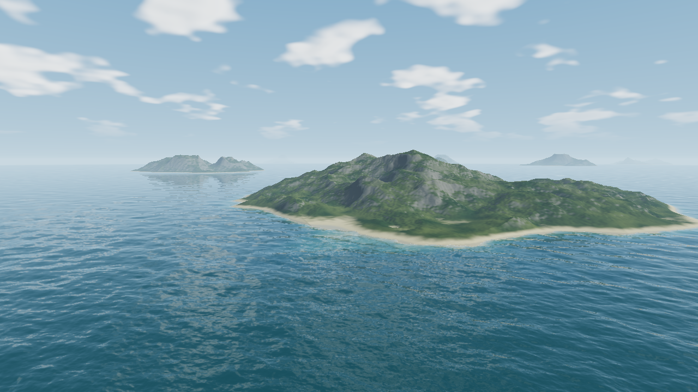

# WaterCuda

[](https://samg-coder.github.io/WaterCuda/?seed=884&view=coast&look=coastal)

**[Open the live demo ↗](https://samg-coder.github.io/WaterCuda/?seed=884&view=coast&look=coastal)** · [Shallows](https://samg-coder.github.io/WaterCuda/?seed=884&view=shore&look=coastal) · [Golden hour](https://samg-coder.github.io/WaterCuda/?seed=884&view=coast&look=golden) · [Aerial](https://samg-coder.github.io/WaterCuda/?seed=884&view=aerial&look=coastal)

The cover is an unedited 1280 × 720 frame exported from WaterCuda in the browser, seed 884, Clear coast. Click it to explore the same island. Use a recent Chrome or Edge with WebGPU support; the first GPU compilation can take a while.

**Coastal ecology / 003:** seeded offshore sandbars, shallow channels, dunes and
procedural shrubs with GPU-generated foliage billboards, wind movement and persistent terrain coverage.
See [the coastal ecology notes](docs/coastal-ecology.md).
See [the implementation and validation notes](docs/coastal-realism.md).

An experimental browser renderer for a procedural infinite archipelago, using the same **CUDA source → WGSL → WebGPU compute** architecture as [stratum-city](https://github.com/SamG-Coder/stratum-city). Islands, terrain materials, ocean displacement, sky, reflections and final pixels are generated by the `.cu` programs. JavaScript handles input, floating-origin bookkeeping, compilation and dispatch.

**New views:** [Sandbars](https://samg-coder.github.io/WaterCuda/?seed=884&view=bars&look=coastal) · [Procedural scrub](https://samg-coder.github.io/WaterCuda/?seed=884&view=scrub&look=coastal)

## Run

Requires Node.js 20+ and a WebGPU-capable browser. No npm dependencies to install.

```sh
git clone https://github.com/SamG-Coder/WaterCuda.git
cd WaterCuda
npm start
```

Open **http://localhost:8090** in Chrome or Edge. On Windows, double-click `START.bat`. The first driver compilation can take up to a couple of minutes on tested hardware. The loading screen remains visible until the first frame completes. Later loads use verified shader artifacts and the browser cache. Use localhost or HTTPS, not `file://`.

## Explore

- Drag to look; WASD or arrows fly along the camera's actual viewing direction; Q/E descend/rise. Space also rises.
- F, the Free camera button, or double-clicking the scene captures mouse-look; Esc releases it. Drag remains available when pointer lock is unsupported.
- Shift boosts speed; Z slows down; wheel adjusts flight speed without an upper speed cap. Z avoids the browser's Ctrl+W shortcut.
- 1/2/3/4 select Coast, Aerial, Waterline and Shallows. Scrub and Sandbars buttons open the new close views. H hides/restores the interface.
- Change the world seed and press ↻. `?seed=12345` opens a specific seed.
- Sea/light presets, water clarity, sun direction, wind, sunlight, resolution and island reflections are adjustable. Auto targets 60 FPS using measured GPU time; fixed resolutions remain available.
- Begin drift moves the camera; Pause ocean freezes wave time. Save image exports the computed frame without the interface.
- Under the surface includes footprint/normal diagnostics and real GPU checks.

Use **7** or **Dive reef** for the underwater preview (seed 884). Q/E now allow diving below sea level.

## Generation and level of detail

**World:** deterministic 4,800 m cells contain bounded procedural islands or open water. Integer cell identities are separate from camera-relative floating-point positions. Visiting new cells does not allocate persistent island meshes or grow memory usage.

**Terrain:** the ray tracer traverses cells, rejects island bounds, then evaluates the shared height field. Broad island silhouettes remain present; high-frequency relief and material grain fade with the projected pixel footprint. The current algorithm is bounded analytical ray marching, not a quadtree mesh or a precomputed min/max hierarchy.

**Underwater:** a continuous seeded seabed connects island shelves across open ocean. Large reef regions contain irregular raised outcrops separated by empty sand/rock areas. Depth controls living cover and growth forms. See [underwater implementation notes](docs/underwater.md) for current limits and validation.

**Water:** four 256 × 256 spectral cascades replace the small analytic wave sum that produced regular crosshatching. CUDA generates a seeded directional Phillips spectrum, evolves it with deep-water dispersion, performs row/column inverse FFTs, and builds height/slope/energy mipmaps. Patch sizes are 32, 128, 512 and 2,048 metres, covering approximately 0.35–192 m wavelengths. Ray intersections use the resulting displaced height field. Trilinear mip sampling follows the projected pixel footprint; lost slope variance goes into shading roughness. Integer modular sampling preserves the field when the origin changes. The combined ocean repeats spatially every 2,048 m; island descriptors are independent.

**Coastal ecology:** submerged sandbanks and deeper channels share the terrain height field; offshore deposits stay at least 1.8 m below mean sea level. Nearby shrubs use two crossed texture cards and a 64 KiB habitat cache. CUDA generates four foliage variants, matching overhead crowns and filtered mipmaps once at startup (2.73 MiB including the cache). Between 65 and 125 m the cards blend into matching seeded crowns in the terrain material; distant plants have no range cutoff. Unresolved crowns become filtered habitat coverage.

Close-up terrain materials use metre-based triplanar colour and bump detail with separate surface filtering, so fine shading detail can remain visible near the camera.

**Shading:** Fresnel reflection, GGX/Smith sun highlights, Snell refraction direction, depth-dependent absorption/scattering, approximate seabed refraction, irregular shoreline foam and caustics. Island reflections trace each visible water pixel using its own wave normal, avoiding block artifacts from half-resolution reconstruction. Terrain adds stratified rock colour, vegetation variation and terrain shadows. Direct and reflected island views share analytically integrated height-dependent haze. No downloaded scene textures, HDRIs or imported models; foliage textures are generated on the GPU. Fonts are optional Google Fonts with system fallbacks.

**Scheduling:** input runs on the browser animation clock; rendering allows at most two outstanding frames without blocking input on GPU completion. Under the surface reports GPU time for spectrum generation, visibility, reflections and shading. The ocean needs about 13.3 MiB of constant storage including cached coefficients, FFT scratch and mipmaps; per-pixel visibility/reflection buffers scale with the selected resolution.

## Validation

```sh
npm test
npm run test:native
```

`npm test` translates all fifteen CUDA entry points and runs eighteen Node tests for free flight, focus handling, diagonal speed, frame-rate independence, world rebasing, seed validation and render alignment, cached wave scheduling, sea looks, shader contracts and the browser fixture server. `test:native` needs a C++17 compiler (`g++`, or set `CXX`), checks terrain against dense traversal and computes an independent double-precision CPU inverse FFT. It regenerates `tests/ocean-reference.json`, used by browser GPU checks.

Open `http://localhost:8090/?test=1` to execute ten GPU checks in the actual browser. They check cached/eager wave equivalence, determinism, terrain and wave rebasing, distant integer coordinates, seed variation, unresolved wave energy, agreement with the independent CPU FFT and WebGPU validation errors.

Verified on this machine in the Chromium-based in-app browser:

- All twelve CUDA entry points translated and created working WebGPU pipelines.
- Seventeen Node tests and ten browser GPU checks passed.
- 192 terrain rays across three occupied seeded islands plus 200 low-angle waterline hillside rays: zero hit/miss mismatches against 0.25 m dense traversal; maximum distance difference about 0.52 m.
- 100 island seeds checked for terrain bounds and cell-edge continuity; 60 close material samples checked for finite output, rebasing stability and detail filtering.
- 100 spectral-water rays: maximum surface-equation residual below 0.004 m.
- The earlier coastal-light release observed approximately 59–60 FPS in seed-884 coastal and shallow-water views at 1280 × 720, with GPU totals around 6–9 ms during spot checks. These are not controlled cross-version or cross-device benchmarks.
- Frame rate depends on view, reflections and internal resolution. The UI reports observed presentation FPS; this is not a cross-device benchmark.

## Current scope and next steps

This is an interactive renderer with a real spectral ocean, not a full fluid simulation. Foam and caustics remain procedural approximations. There are no trees, erosion simulation, breaking surf, underwater camera mode, collision-constrained walking or temporal antialiasing yet. Reflections can still shimmer in motion, especially near distant coastlines. Terrain marching uses a heuristic slope bound and one-metre minimum steps; tiny intersections outside the tested fixtures are not guaranteed. Island reflection queries fade out at 6.5 km, and the primary draw distance is 18 km. Integer coordinates are finite (roughly ±2.147 billion cells); “infinite” means on-demand generation without a prebuilt map boundary.

The next realism pass should add horizontal choppy-wave displacement, a local shallow-water region coupled to terrain depth, persistent advected foam, and temporal reflection filtering. A GPU min/max terrain hierarchy would allow conservative empty-space skipping at higher terrain detail. See [architecture notes](docs/architecture.md).

## Source and attribution

`kernels/` is the scene source. `src/` contains the browser shell, renderer and shader loader. `generated/` and `Water.cu` are generated outputs. `vendor/cuda-webshader/` and the shader loader/build support are adapted from stratum-city at commit `62ef0b067a68407c76ced0bb58b6bfd4b753d6ca`; the original MIT license and bundled third-party notices are retained.

## Native C++ / CUDA version

The [native/](native/README.md) subfolder builds a Windows desktop viewer and headless renderer with NVIDIA CUDA. It compiles the exact same `kernels/*.cu` files directly with `nvcc`, including the ocean FFT, terrain, billboards and shading. From the repository root, run `powershell -ExecutionPolicy Bypass -File native/build.ps1 -Test -Run`. See the native README for requirements, controls and image export.
