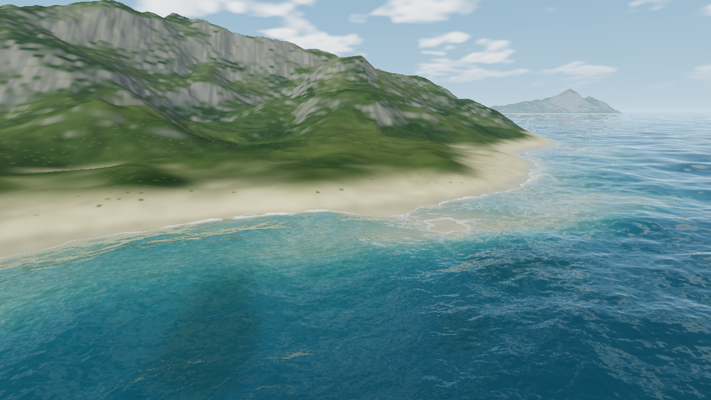
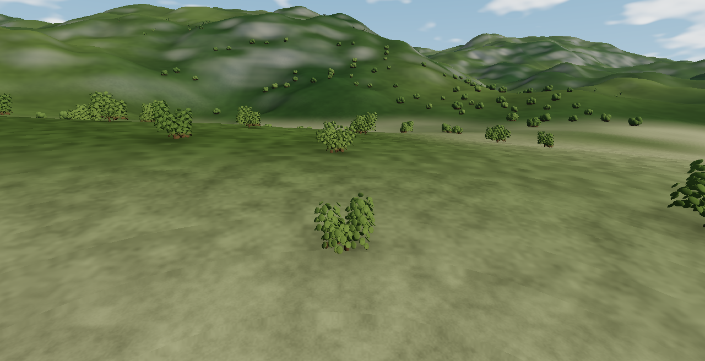

# Coastal ecology

Everything is authored in CUDA and compiled to WebGPU. No plant meshes or foliage image files are downloaded.

## Submerged sandbars

Seeded sediment bands follow selected coastal depth contours. Offshore deposits approach a ceiling 1.8 metres below mean sea level, leaving pale seabed visible through shallow water and deeper channels between banks. They cannot create exposed strips of sand. Existing dry beaches retain their dune relief. The water remains the displaced spectral ocean; refraction, absorption and caustics reveal the bed.

## Generated foliage billboards

A one-time CUDA pass projects seeded leaves into four 128-pixel side-view textures and four matching overhead crown textures. Premultiplied RGBA mipmaps preserve average coverage; trilinear sampling filters detail with pixel footprint. The atlas and habitat patch occupy 2.73 MiB together, sharing one storage binding.

Each close shrub uses two crossed alpha-tested texture cards, replacing hundreds of branch and leaf intersections. Wind offsets the upper card texture. Habitat is deterministic in six-metre cells, excluding underwater ground and steep slopes. A 64-by-64 cell cache updates only on cell, seed or origin changes.

Between 65 and 125 metres, stable coverage dithering blends the cards into overhead crowns in the terrain material. The crowns use the same world cell, seed, position, size and foliage variant, including outside the near cache. There is no distance cutoff for terrain vegetation. Subpixel crowns transition to average habitat coverage rather than flickering or disappearing. Direct and reflected terrain share this material.

These are textured shrub impostors. They do not provide individual leaf geometry, fully traced leaf shadows or a botanical species library. Ground contact darkening and foliage lighting are approximations; at long range the representation lies on the terrain.

## Validation

- Node checks cover source hashes, baseline WebGPU resource limits, frame cache invalidation and existing controls.
- Native CUDA checks compare all 4,096 habitat cache entries with direct generation, ray/card traversal and origin rebasing.
- Atlas checks verify transparent borders and conservation of coverage through mipmaps.
- Distant crown checks exercise vegetation beyond the card and cache ranges.
- Offshore surveys verify raised seabed stays submerged while deeper channels remain.
- Real-browser validation checks shader compilation, rendering and the existing GPU fixtures.
